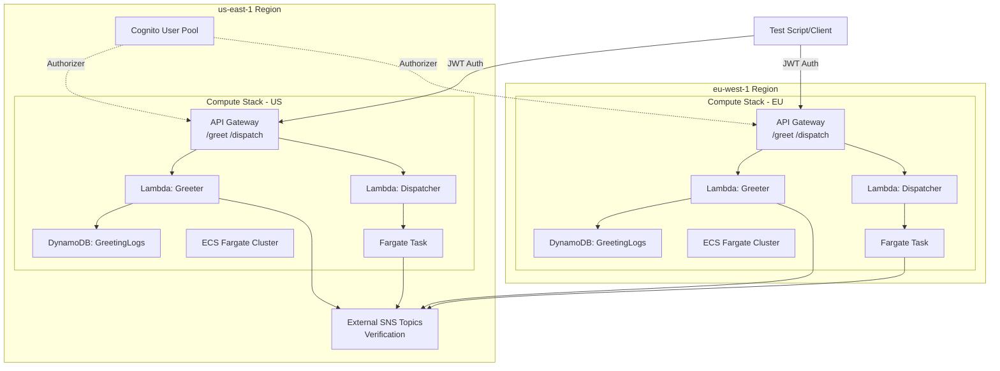

# Multi-Region AWS Infrastructure

This project implements a production-ready, multi-region AWS infrastructure using Terraform that demonstrates enterprise-grade patterns for authentication, compute distribution, and automated deployment. The architecture uses a centralized Cognito User Pool in us-east-1 to secure API Gateway endpoints across two regions (us-east-1 and eu-west-1), with each region containing identical compute stacks.

## Overview

The infrastructure includes:

- Centralized Amazon Cognito User Pool for authentication (us-east-1)
- Regional compute stacks deployed in us-east-1 and eu-west-1
- API Gateway with JWT authorization
- AWS Lambda functions for serverless compute
- ECS Fargate for containerized workloads
- DynamoDB tables for regional data storage
- Automated testing script for validation
- CI/CD pipeline with security scanning

## Architecture



### Key Features

- Single source of truth for authentication (Cognito in us-east-1)
- Regional data isolation with low-latency access
- Cost-optimized design (public subnets for Fargate, no NAT Gateway)
- Modular Terraform structure for easy region expansion
- Comprehensive security scanning and validation

## Prerequisites

Before deploying this infrastructure, ensure you have:

- Terraform >= 1.0 installed ([Installation Guide](https://developer.hashicorp.com/terraform/downloads))
- AWS CLI configured with appropriate credentials ([Configuration Guide](https://docs.aws.amazon.com/cli/latest/userguide/cli-configure-quickstart.html))
- Python 3.x with pip for running tests
- AWS account with permissions to create:
  - Cognito User Pools
  - API Gateway
  - Lambda Functions
  - ECS Clusters and Tasks
  - DynamoDB Tables
  - IAM Roles and Policies
  - VPC resources

## Manual Deployment

### Step 1: Clone the Repository

```bash
git clone https://github.com/sonuabraham/aws-assessment
cd aws-assessment/terraform
```

### Step 2: Configure Variables

Copy the example variables file and customize it:

```bash
cp terraform.tfvars.example terraform.tfvars
```

Edit `terraform.tfvars` with your values:

```hcl
user_email = "sonuabraham2001@gmail.com"
user_password = "YourSecurePassword123!"
github_repo = "https://github.com/sonuabraham/aws-assessment"
sns_topic_arn_lambda = "arn:aws:sns:us-east-1:637226132752:Candidate-Verification-Topic1"
sns_topic_arn_ecs = "arn:aws:sns:us-east-1:637226132752:Candidate-Verification-Topic"
```

Variable descriptions:

- `user_email`: Email address for the Cognito test user
- `user_password`: Password for the test user (must meet Cognito password policy)
- `github_repo`: Your GitHub repository URL
- `sns_topic_arn_lambda`: SNS topic ARN for Lambda verification messages
- `sns_topic_arn_ecs`: SNS topic ARN for ECS verification messages

### Step 3: Initialize Terraform

Initialize the Terraform working directory and download required providers:

```bash
terraform init
```

This command will:

- Download the AWS provider plugins
- Initialize the backend configuration
- Prepare module dependencies

### Step 4: Review the Deployment Plan

Generate and review an execution plan:

```bash
terraform plan
```

Review the output to understand what resources will be created. You should see:

- 1 Cognito User Pool and Client
- 2 Regional stacks (us-east-1 and eu-west-1)
- API Gateways, Lambda functions, DynamoDB tables, ECS clusters per region
- IAM roles and policies

To save the plan for later use:

```bash
terraform plan -out=tfplan
```

### Step 5: Deploy the Infrastructure

Apply the Terraform configuration:

```bash
terraform apply
```

Or, if you saved a plan:

```bash
terraform apply tfplan
```

Type `yes` when prompted to confirm the deployment. The deployment typically takes 3-5 minutes.

### Step 6: Retrieve Outputs

After successful deployment, retrieve the infrastructure outputs:

```bash
terraform output
```

To get outputs in JSON format:

```bash
terraform output -json > outputs.json
```

Key outputs include:

- `cognito_user_pool_id`: Cognito User Pool ID
- `cognito_client_id`: Cognito Client ID for authentication
- `api_endpoint_us_east_1`: API Gateway endpoint for us-east-1
- `api_endpoint_eu_west_1`: API Gateway endpoint for eu-west-1
- `dynamodb_table_us_east_1`: DynamoDB table name in us-east-1
- `dynamodb_table_eu_west_1`: DynamoDB table name in eu-west-1

To retrieve a specific output:

```bash
terraform output cognito_user_pool_id
```

## Running the Test Script

The test script validates the deployment by authenticating with Cognito and making concurrent API calls to both regions.

### Step 1: Install Python Dependencies

Navigate to the tests directory and install required packages:

```bash
cd ../tests
pip install -r requirements.txt
```

Required dependencies:

- `boto3`: AWS SDK for Python
- `requests`: HTTP library for API calls

### Step 2: Set Up Cognito User

Before running tests, ensure the Cognito user password is set (if using a temporary password):

```bash
python setup_cognito_user.py
```

This script will prompt you to change the temporary password if needed.

### Step 3: Run the Test Script

Execute the test script with the required parameters:

```bash
python test_deployment.py \
  --user-pool-id <cognito-user-pool-id> \
  --client-id <cognito-client-id> \
  --username sonuabraham2001@gmail.com \
  --password <your-password> \
  --api-us <us-east-1-api-endpoint> \
  --api-eu <eu-west-1-api-endpoint>
```

Example with actual values:

```bash
python test_deployment.py \
  --user-pool-id us-east-1_ABC123 \
  --client-id 1234567890abcdef \
  --username sonuabraham2001@gmail.com \
  --password MySecurePass123! \
  --api-us https://abc123.execute-api.us-east-1.amazonaws.com \
  --api-eu https://def456.execute-api.eu-west-1.amazonaws.com
```

### Expected Output

The test script will display:

```
=== Authentication ===
✓ Successfully authenticated with Cognito
Token: eyJraWQiOiJ...

=== Testing /greet endpoint ===
Testing us-east-1...
✓ us-east-1 response (234ms): {"message": "Greeting processed", "region": "us-east-1", ...}

Testing eu-west-1...
✓ eu-west-1 response (456ms): {"message": "Greeting processed", "region": "eu-west-1", ...}

=== Testing /dispatch endpoint ===
Testing us-east-1...
✓ us-east-1 response (567ms): {"message": "Task dispatched", "task_arn": "arn:aws:ecs:...", ...}

Testing eu-west-1...
✓ eu-west-1 response (789ms): {"message": "Task dispatched", "task_arn": "arn:aws:ecs:...", ...}

=== Latency Comparison ===
us-east-1 average: 400ms
eu-west-1 average: 622ms
```

The script validates:

- Successful Cognito authentication
- HTTP 200 responses from all endpoints
- Correct region in response payloads
- Latency measurements for performance comparison

## Multi-Region Provider Structure

This infrastructure uses Terraform provider aliases to deploy resources across multiple AWS regions from a single configuration.

### Provider Configuration

The root `main.tf` defines two AWS provider instances:

```hcl
# Primary provider for us-east-1 (Cognito + Regional Stack)
provider "aws" {
  region = "us-east-1"
  alias  = "us_east_1"
}

# Secondary provider for eu-west-1 (Regional Stack only)
provider "aws" {
  region = "eu-west-1"
  alias  = "eu_west_1"
}
```

### Module Instantiation

Modules are instantiated with explicit provider assignments:

```hcl
# Cognito module (us-east-1 only)
module "cognito" {
  source = "./modules/cognito"
  providers = {
    aws = aws.us_east_1
  }
  user_email    = var.user_email
  user_password = var.user_password
}

# Regional stack for us-east-1
module "regional_stack_us" {
  source = "./modules/regional-stack"
  providers = {
    aws = aws.us_east_1
  }
  region                = "us-east-1"
  cognito_user_pool_arn = module.cognito.user_pool_arn
  sns_topic_arn_lambda  = var.sns_topic_arn_lambda
  sns_topic_arn_ecs     = var.sns_topic_arn_ecs
  user_email            = var.user_email
  github_repo           = var.github_repo
}

# Regional stack for eu-west-1
module "regional_stack_eu" {
  source = "./modules/regional-stack"
  providers = {
    aws = aws.eu_west_1
  }
  region                = "eu-west-1"
  cognito_user_pool_arn = module.cognito.user_pool_arn
  sns_topic_arn_lambda  = var.sns_topic_arn_lambda
  sns_topic_arn_ecs     = var.sns_topic_arn_ecs
  user_email            = var.user_email
  github_repo           = var.github_repo
}
```

### Adding Additional Regions

To add a new region (e.g., ap-southeast-1):

1. Add a new provider alias in `main.tf`:

```hcl
provider "aws" {
  region = "ap-southeast-1"
  alias  = "ap_southeast_1"
}
```

2. Instantiate the regional stack module:

```hcl
module "regional_stack_ap" {
  source = "./modules/regional-stack"
  providers = {
    aws = aws.ap_southeast_1
  }
  region                = "ap-southeast-1"
  cognito_user_pool_arn = module.cognito.user_pool_arn
  sns_topic_arn_lambda  = var.sns_topic_arn_lambda
  sns_topic_arn_ecs     = var.sns_topic_arn_ecs
  user_email            = var.user_email
  github_repo           = var.github_repo
}
```

3. Add outputs in `outputs.tf`:

```hcl
output "api_endpoint_ap_southeast_1" {
  value       = module.regional_stack_ap.api_endpoint
  description = "API Gateway endpoint for ap-southeast-1"
}
```

4. Run `terraform plan` and `terraform apply` to deploy the new region.

### Benefits of This Approach

- Reusable modules with provider injection
- Clear separation of regional resources
- Easy to add or remove regions
- Single state file for all regions
- Cross-region references work seamlessly (e.g., Cognito ARN)

## Cost Optimization

This infrastructure is designed with cost optimization in mind:

- No NAT Gateway: Fargate tasks use public subnets with public IPs, saving ~$32/month per AZ
- DynamoDB On-Demand: Pay-per-request billing instead of provisioned capacity
- HTTP API Gateway: Lower cost than REST API (~$1/million requests)
- Minimal Lambda resources: 256MB memory, 30s timeout
- Small Fargate tasks: 0.25 vCPU, 512MB memory
- Container Insights disabled: Reduces CloudWatch costs

Estimated monthly cost for low-traffic development/testing: <$5

## CI/CD Pipeline

The project includes a GitHub Actions workflow (`.github/workflows/deploy.yml`) that automates validation, security scanning, and deployment.

### Pipeline Stages

1. Checkout: Clone repository code
2. Lint & Format: Run `terraform fmt -check -recursive`
3. Validate: Run `terraform init` and `terraform validate`
4. Security Scan: Run `tfsec` to detect security misconfigurations
5. Plan: Generate `terraform plan` output
6. Test Placeholder: Shows where automated tests would run

### Triggers

- Push to main branch
- Pull requests to main branch
- Manual workflow dispatch

### Security Scanning

The pipeline uses `tfsec` to scan for common security issues:

- Unencrypted resources
- Overly permissive IAM policies
- Missing security group rules
- Public access misconfigurations

The pipeline fails if HIGH or CRITICAL issues are detected.

### Running the Pipeline

The pipeline runs automatically on push/PR. To trigger manually:

1. Go to Actions tab in GitHub
2. Select "Deploy Infrastructure" workflow
3. Click "Run workflow"

## Troubleshooting

### Terraform Errors

Issue: "Error: error configuring Terraform AWS Provider: no valid credential sources"
Solution: Configure AWS credentials using `aws configure` or set environment variables:

```bash
export AWS_ACCESS_KEY_ID="your-access-key"
export AWS_SECRET_ACCESS_KEY="your-secret-key"
export AWS_DEFAULT_REGION="us-east-1"
```

Issue: "Error: error creating Cognito User Pool: InvalidParameterException"
Solution: Ensure the password meets Cognito requirements (min 8 chars, uppercase, lowercase, numbers, symbols)

### Test Script Errors

Issue: "NotAuthorizedException: Incorrect username or password"
Solution: Verify credentials and ensure the user exists in Cognito. Run `setup_cognito_user.py` to reset password.

Issue: "401 Unauthorized" from API Gateway
Solution: Check that the JWT token is valid and not expired. Tokens expire after 1 hour by default.

### ECS Task Failures

Issue: ECS tasks fail to start
Solution: Check CloudWatch Logs for the task. Common issues:

- IAM role missing SNS permissions
- Invalid SNS topic ARN
- Network connectivity issues

### DynamoDB Access Denied

Issue: Lambda function cannot write to DynamoDB
Solution: Verify the Lambda execution role has `dynamodb:PutItem` permission on the regional table.

## Cleanup

To destroy all resources and avoid ongoing charges:

```bash
cd terraform
terraform destroy
```

Type `yes` when prompted. This will remove:

- All Lambda functions
- API Gateways
- DynamoDB tables
- ECS clusters and task definitions
- Cognito User Pool
- IAM roles and policies
- VPC resources

Note: Ensure no data needs to be preserved before destroying resources.

## Module Structure

```
terraform/
├── main.tf                    # Root module with provider configuration
├── variables.tf               # Global variables
├── outputs.tf                 # Root outputs
├── terraform.tfvars          # Variable values (not in git)
├── terraform.tfvars.example  # Example variable values
├── modules/
│   ├── cognito/              # Cognito User Pool module
│   │   ├── main.tf
│   │   ├── variables.tf
│   │   └── outputs.tf
│   └── regional-stack/       # Reusable regional compute module
│       ├── main.tf
│       ├── variables.tf
│       ├── outputs.tf
│       ├── api-gateway.tf    # API Gateway resources
│       ├── lambda.tf         # Lambda functions
│       ├── dynamodb.tf       # DynamoDB tables
│       ├── ecs.tf            # ECS Fargate resources
│       ├── iam.tf            # IAM roles and policies
│       └── lambda_functions/ # Lambda function code
│           ├── greeter/
│           └── dispatcher/
```

## Additional Resources

- [Terraform AWS Provider Documentation](https://registry.terraform.io/providers/hashicorp/aws/latest/docs)
- [AWS Cognito Documentation](https://docs.aws.amazon.com/cognito/)
- [AWS API Gateway Documentation](https://docs.aws.amazon.com/apigateway/)
- [AWS Lambda Documentation](https://docs.aws.amazon.com/lambda/)
- [AWS ECS Fargate Documentation](https://docs.aws.amazon.com/AmazonECS/latest/developerguide/AWS_Fargate.html)

## License

This project is provided as-is for educational and demonstration purposes.
